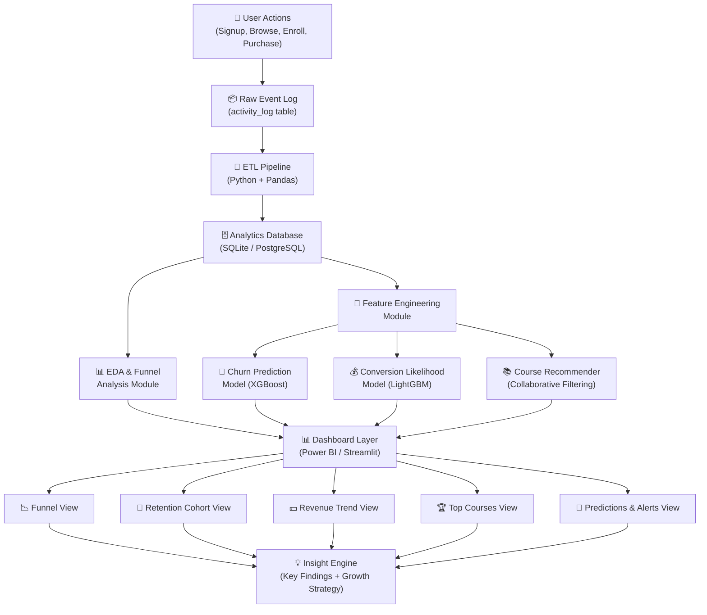

# 📚 EdTech Growth Analytics — Complete Project Documentation

> **Project:** EdTech User Behaviour & Revenue Growth Intelligence Platform  
> **Role:** Data Analyst / ML Engineer  
> **Date:** March 2026  
> **Status:** Full Design + Implementation Blueprint

---

## 📋 Table of Contents

1. [Problem Statement](#1-problem-statement)
2. [What the Problem Statement Solves](#2-what-the-problem-statement-solves)
3. [Solution Framework](#3-solution-framework)
4. [Approach to Reach Solutions](#4-approach-to-reach-solutions)
5. [Tech Stack](#5-tech-stack)
6. [Architecture Diagram](#6-architecture-diagram)
7. [Dataset Design — Schema & Attributes](#7-dataset-design--schema--attributes)
8. [ML Models & Prediction Logic](#8-ml-models--prediction-logic)
9. [Complete Project Flow](#9-complete-project-flow)
10. [Dashboard Design](#10-dashboard-design)
11. [Key Insights (5–7 Findings)](#11-key-insights-57-findings)
12. [Growth Strategy Recommendations](#12-growth-strategy-recommendations)

---

## 1. Problem Statement

> **"An EdTech startup is experiencing stagnant revenue growth despite a rising user base due to critical drop-offs at multiple journey stages — from post-signup inactivity, low course engagement, and poor paid conversion rates — indicating a fundamental misalignment between user intent, product experience, and monetization strategy."**

### Context
The platform has:
- **High signup volume** but most users abandon within 48–72 hours
- **Low course completion** (~15–22% based on industry benchmarks for EdTech)
- **Poor free → paid conversion** (sub-5% when the industry healthy range is 8–15%)
- **Slow revenue growth** despite user acquisition investment going up

### Root Cause Hypothesis
The problem is **not acquisition** — it's **activation, engagement, and monetization**. The AARRR (Pirate Metrics) funnel is leaking at:
- **Activation**: Users don't experience the "aha moment" quickly enough
- **Retention**: No habit loop or re-engagement mechanism
- **Revenue**: Pricing / value proposition unclear at conversion point

---

## 2. What the Problem Statement Solves

| # | Problem Solved | Business Impact |
|---|---------------|-----------------|
| 1 | **Identifies where users drop off** in the funnel (Signup → Browse → Enroll → Complete → Pay) | Reduces wasted acquisition spend |
| 2 | **Pinpoints which courses drive completion and revenue** | Enables content investment prioritization |
| 3 | **Reveals behavioral patterns of converting users** vs. churned users | Improves targeting and onboarding |
| 4 | **Quantifies retention cohorts** (Day 1, Day 7, Day 30) | Informs re-engagement campaign scheduling |
| 5 | **Predicts churn risk** before users leave | Enables proactive intervention |
| 6 | **Recommends personalized course paths** | Improves engagement and completion rates |
| 7 | **Models revenue elasticity** by pricing tier and user segment | Optimizes monetization strategy |

---

## 3. Solution Framework

The platform delivers four interconnected intelligence pillars:

```
┌─────────────────────────────────────────────────────────┐
│                 INTELLIGENCE PILLARS                     │
│                                                          │
│  1. FUNNEL INTELLIGENCE  →  Where are users dropping?   │
│  2. ENGAGEMENT INTEL     →  What keeps users active?    │
│  3. REVENUE INTEL        →  What drives conversions?    │
│  4. PREDICTIVE INTEL     →  What will happen next?      │
└─────────────────────────────────────────────────────────┘
```

### Pillar 1 — Funnel Intelligence
- Step-by-step conversion rates: Signup → Profile Complete → Browse → Enroll → Progress > 50% → Complete → Purchase
- Identify the single biggest drop-off stage

### Pillar 2 — Engagement Intelligence
- Daily/Weekly Active Users (DAU/WAU)
- Cohort retention curves
- Content consumption patterns by device, time, category

### Pillar 3 — Revenue Intelligence
- Revenue by course, category, pricing plan
- LTV (Lifetime Value) by acquisition channel and user segment
- Discount sensitivity analysis

### Pillar 4 — Predictive Intelligence
- Churn prediction (who will leave in next 7 days)
- Conversion prediction (who will pay if nudged)
- Course recommendation (what to show next)

---

## 4. Approach to Reach Solutions

### Phase 1: Data Design & Generation (Week 1)
1. Design normalized relational schema (4 core tables + 2 derived)
2. Generate synthetic but realistic dataset (3,000–5,000 users)
3. Inject realistic distributions: signup spikes, drop-offs, seasonal revenue patterns

### Phase 2: Exploratory Data Analysis (Week 2)
1. Funnel visualization — Plotly / Power BI funnels
2. Cohort analysis — retention heatmaps
3. Revenue trend analysis
4. Correlation analysis: activity features vs. conversion

### Phase 3: Feature Engineering (Week 2–3)
Create derived behavioral features:
- `days_since_last_login`
- `completion_rate` = completed_lessons / enrolled_lessons
- `session_frequency_7d`
- `avg_session_duration_minutes`
- `courses_enrolled_count`
- `revenue_generated`
- `discount_used_flag`

### Phase 4: ML Model Training (Week 3–4)
- Train Churn Prediction model
- Train Conversion Likelihood model
- Build Course Recommender

### Phase 5: Dashboard Build (Week 4–5)
- Power BI / Streamlit interactive dashboard
- Funnel, Retention, Revenue, Top Courses views

### Phase 6: Insight Synthesis & Strategy (Week 5)
- Derive 5–7 key findings
- Formulate pricing, product, and retention strategy

---

## 5. Tech Stack

### Data Generation & Processing
| Tool | Purpose |
|------|---------|
| **Python 3.11+** | Core scripting and data generation |
| **Pandas** | Data manipulation and aggregation |
| **NumPy** | Statistical distributions for realistic data |
| **Faker** | Realistic synthetic user data generation |
| **SQLite / PostgreSQL** | Relational data storage |
| **SQLAlchemy** | ORM layer for DB interactions |

### Analytics & EDA
| Tool | Purpose |
|------|---------|
| **Pandas Profiling / ydata-profiling** | Automated EDA reports |
| **Matplotlib / Seaborn** | Static visualizations |
| **Plotly** | Interactive charts |
| **Lifelines** | Survival analysis & cohort retention |

### Machine Learning
| Tool | Purpose |
|------|---------|
| **Scikit-learn** | Classification (Churn, Conversion), preprocessing |
| **XGBoost / LightGBM** | Gradient boosting for structured data |
| **Imbalanced-learn (SMOTE)** | Handle class imbalance in churn labels |
| **Surprise / Implicit** | Collaborative filtering for recommendations |
| **SHAP** | Model explainability |

### Dashboard & Visualization
| Tool | Purpose |
|------|---------|
| **Power BI** | Primary business dashboard |
| **Streamlit** (optional) | Interactive Python-based dashboard alternative |
| **DAX** | Power BI calculated measures |

### Deployment (Optional)
| Tool | Purpose |
|------|---------|
| **FastAPI** | REST API serving ML model predictions |
| **Docker** | Containerization |
| **GitHub Actions** | CI/CD pipeline |

---

## 6. Architecture Diagram



### Data Flow Explanation

```
[User Activity] 
    │
    ▼
[Raw Tables: users, courses, activity_log, transactions]
    │
    ▼
[Feature Store: user_features_engineered]
    │
    ├──► [ML Models] ──► [Churn Score, Conversion Score, Recommendations]
    │
    └──► [Aggregations] ──► [Funnel Metrics, Cohort Tables, Revenue Tables]
                                    │
                                    ▼
                            [Dashboard (Power BI)]
                                    │
                                    ▼
                        [Insights + Growth Recommendations]
```

---

## 7. Dataset Design — Schema & Attributes

### Overview: 4 Core Tables

```
users (3000–5000 rows)
    │── 1:N ──► activity_log (50,000–200,000 rows)
    │── 1:N ──► transactions (5,000–15,000 rows)
    │
courses (50–100 rows)
    │── 1:N ──► activity_log
    │── 1:N ──► transactions
```

---

### Table 1: `users`

| Column | Data Type | Description | Realistic Values |
|--------|-----------|-------------|-----------------|
| `user_id` | VARCHAR PK | Unique user identifier | UUID format |
| `signup_date` | DATE | Registration date | Last 18 months, weighted toward recent |
| `signup_channel` | VARCHAR | Acquisition source | `organic`, `google_ads`, `instagram`, `referral`, `email_campaign`, `youtube` |
| `country` | VARCHAR | User country | India, USA, UK, Nigeria, Brazil (weighted) |
| `age_group` | VARCHAR | Age bracket | `18-24`, `25-34`, `35-44`, `45+` |
| `gender` | VARCHAR | Gender | `male`, `female`, `non-binary`, `prefer_not_to_say` |
| `device_type` | VARCHAR | Primary device | `mobile`, `desktop`, `tablet` (60/30/10 split) |
| `plan_type` | VARCHAR | Current subscription | `free`, `basic`, `pro`, `enterprise` |
| `profile_completed` | BOOLEAN | Did user complete profile? | ~60% True |
| `email_verified` | BOOLEAN | Email verified? | ~85% True |
| `onboarding_completed` | BOOLEAN | Completed onboarding flow? | ~40% True |
| `first_course_enrolled_date` | DATE | Date of first enrollment | NULL if never enrolled |
| `lifetime_revenue` | FLOAT | Total amount paid | 0.0 for free users |
| `is_churned` | BOOLEAN | Churned label (no login in 30+ days) | ~45% True |
| `churn_date` | DATE | Date marked as churned | NULL if active |
| `referral_count` | INT | Users referred | 0–15, skewed heavily to 0 |
| `support_tickets_raised` | INT | Support tickets submitted | 0–8 |
| `utm_source` | VARCHAR | UTM tracking source | `google`, `facebook`, `twitter`, `direct` |
| `last_login_date` | DATE | Most recent login | Derived from activity_log |

---

### Table 2: `courses`

| Column | Data Type | Description | Realistic Values |
|--------|-----------|-------------|-----------------|
| `course_id` | VARCHAR PK | Unique course identifier | `CRS-001` to `CRS-100` |
| `course_name` | VARCHAR | Course title | E.g., "Python for Beginners", "Data Science Bootcamp" |
| `category` | VARCHAR | Subject category | `tech`, `business`, `design`, `marketing`, `personal_dev`, `finance` |
| `difficulty_level` | VARCHAR | Difficulty | `beginner`, `intermediate`, `advanced` |
| `duration_hours` | FLOAT | Total course hours | 2.0 – 40.0 |
| `num_lessons` | INT | Number of lessons | 5 – 120 |
| `instructor_name` | VARCHAR | Course instructor | Faker generated |
| `price_usd` | FLOAT | Course price | 0 (free), 9.99, 19.99, 49.99, 99.99, 199.99 |
| `avg_rating` | FLOAT | Average student rating | 3.2 – 5.0 |
| `total_enrollments` | INT | Total enrolled students | Derived/aggregated |
| `completion_rate_pct` | FLOAT | Course-level completion % | 5% – 85% |
| `is_featured` | BOOLEAN | Featured on homepage? | ~15% True |
| `launch_date` | DATE | When course was published | Last 24 months |
| `has_certificate` | BOOLEAN | Offers completion certificate? | ~60% True |
| `language` | VARCHAR | Course language | `english`, `hindi`, `spanish`, `french` |

---

### Table 3: `activity_log`

This is the **most granular and analytically rich table** — every user interaction.

| Column | Data Type | Description | Realistic Values |
|--------|-----------|-------------|-----------------|
| `event_id` | VARCHAR PK | Unique event identifier | UUID |
| `user_id` | VARCHAR FK | References users table | |
| `course_id` | VARCHAR FK | References courses (NULL for non-course events) | |
| `event_type` | VARCHAR | Type of activity | See Event Types below |
| `event_timestamp` | DATETIME | When the event occurred | |
| `session_id` | VARCHAR | Groups events in same session | |
| `session_duration_minutes` | FLOAT | Duration of session | 1 – 180 mins |
| `lesson_id` | VARCHAR | Specific lesson interacted | NULL if not lesson event |
| `lesson_number` | INT | Lesson number within course | 1 – num_lessons |
| `progress_pct` | FLOAT | Course progress at time of event | 0 – 100 |
| `device_type` | VARCHAR | Device used for this session | `mobile`, `desktop`, `tablet` |
| `platform` | VARCHAR | Platform/OS | `ios`, `android`, `windows`, `macos`, `web` |
| `video_watch_pct` | FLOAT | % of video watched (if video lesson) | 0 – 100 |
| `quiz_attempted` | BOOLEAN | Was a quiz attempted? | |
| `quiz_score` | FLOAT | Quiz score (0–100) | NULL if no quiz |

**Event Types Enum:**
```
signup, email_verify, profile_complete, onboarding_step_1,
onboarding_step_2, onboarding_step_3, course_browse, 
course_detail_view, course_enroll, lesson_start, lesson_complete,
lesson_pause, lesson_resume, quiz_attempt, quiz_pass, quiz_fail,
course_complete, certificate_download, payment_initiate, 
payment_complete, payment_fail, subscription_upgrade,
subscription_cancel, referral_sent, support_ticket, 
app_open, search
```

---

### Table 4: `transactions`

| Column | Data Type | Description | Realistic Values |
|--------|-----------|-------------|-----------------|
| `transaction_id` | VARCHAR PK | Unique transaction ID | UUID |
| `user_id` | VARCHAR FK | References users | |
| `course_id` | VARCHAR FK | Course purchased (NULL for subscriptions) | |
| `transaction_date` | DATE | Purchase date | |
| `transaction_type` | VARCHAR | Type | `one_time_purchase`, `subscription_monthly`, `subscription_annual` |
| `amount_usd` | FLOAT | Amount paid | 9.99 – 499.99 |
| `payment_method` | VARCHAR | Payment method | `credit_card`, `upi`, `paypal`, `netbanking` |
| `coupon_used` | BOOLEAN | Was a discount coupon used? | ~30% True |
| `discount_pct` | FLOAT | Discount percentage | 0, 10, 20, 30, 50 |
| `currency` | VARCHAR | Transaction currency | `USD`, `INR`, `GBP` |
| `status` | VARCHAR | Transaction status | `success`, `failed`, `refunded` |
| `plan_type_purchased` | VARCHAR | Plan purchased | `basic`, `pro`, `enterprise` |
| `is_first_purchase` | BOOLEAN | First ever purchase by user? | |
| `days_since_signup` | INT | Days from signup to this purchase | 0 – 365+ |

---

### Derived / Engineered Feature Table: `user_features`

This table is computed from the above 4 tables and feeds the ML models.

| Feature | Formula | ML Use |
|---------|---------|--------|
| `days_since_signup` | TODAY - signup_date | Churn, Conversion |
| `days_since_last_login` | TODAY - max(event_timestamp) | Churn (HIGH WEIGHT) |
| `total_sessions` | COUNT(DISTINCT session_id) | Engagement score |
| `avg_session_duration` | AVG(session_duration_minutes) | Engagement |
| `total_lessons_started` | COUNT(lesson_start events) | Engagement |
| `total_lessons_completed` | COUNT(lesson_complete events) | Completion rate |
| `lesson_completion_rate` | completed / started | Churn, Conversion |
| `courses_enrolled` | COUNT(course_enroll events) | Conversion signal |
| `courses_completed` | COUNT(course_complete events) | LTV signal |
| `quiz_pass_rate` | passed / attempted quizzes | Engagement quality |
| `has_paid` | is_churned label inverse flag | Conversion target |
| `total_revenue` | SUM(amount_usd) | Revenue model |
| `onboarding_steps_completed` | 0–3 | Activation metric |
| `first_7d_sessions` | Sessions in first 7 days | Early retention |
| `referral_count` | FROM users table | Virality |
| `support_tickets` | FROM users table | Dissatisfaction signal |
| `days_to_first_enroll` | first enrollment - signup | Activation speed |
| `discount_sensitivity` | % of purchases using coupons | Pricing intelligence |

---

## 8. ML Models & Prediction Logic

### Model 1: Churn Prediction 🔴

**Question Answered:** "Which currently active users are at risk of churning in the next 7–14 days?"

**Algorithm:** `XGBoost Classifier` (best for tabular, imbalanced data)

**Target Variable:** `is_churned` (Binary: 1 = churned, 0 = active)

**Key Features (ranked by expected SHAP importance):**
1. `days_since_last_login` ← **Most important**
2. `lesson_completion_rate`
3. `first_7d_sessions`
4. `avg_session_duration`
5. `courses_enrolled`
6. `onboarding_steps_completed`
7. `support_tickets`
8. `days_to_first_enroll`
9. `quiz_pass_rate`
10. `signup_channel`

**Class Imbalance Handling:** SMOTE (Synthetic Minority Oversampling) since active users > churned in training window

**Evaluation Metrics:**
- **Primary:** AUC-ROC (target > 0.80)
- **Secondary:** Precision @ 80% Recall (to limit false alarms)
- F1-Score

**Output:** `churn_probability_score` (0.0 – 1.0) per user  
**Threshold:** 0.65 → trigger re-engagement email/notification

---

### Model 2: Conversion Likelihood Prediction 💰

**Question Answered:** "Which free users are most likely to convert to a paid plan in the next 30 days?"

**Algorithm:** `LightGBM Classifier`

**Target Variable:** `converted_to_paid` (Binary)

**Key Features:**
1. `courses_completed`
2. `lesson_completion_rate`
3. `avg_session_duration`
4. `days_since_signup` (negative: older free users less likely to convert)
5. `has_certificate_earned`
6. `total_revenue` (0 for target group)
7. `signup_channel` (organic > paid ads in conversion quality)
8. `first_7d_sessions`
9. `device_type`
10. `onboarding_completed`

**Evaluation Metrics:**
- AUC-ROC (target > 0.78)
- Precision-Recall curve
- Lift curve (how much better than random targeting?)

**Output:** `conversion_probability_score` (0.0 – 1.0)  
**Business Use:** Trigger personalized discount offer to top 20% scorers

---

### Model 3: Course Recommender 📚

**Question Answered:** "What course should we recommend to each user to maximize engagement?"

**Algorithm:** `Matrix Factorization (SVD) via Surprise library` + `Content-Based Filtering (TF-IDF on course metadata)`

**Hybrid Approach:**
```
Final Score = 0.6 × Collaborative Score + 0.4 × Content-Based Score
```

**Collaborative Filtering:**
- User-Item matrix: `users × courses` with completion_rate as rating proxy
- SVD decomposes to latent user/course factors
- Predicts rating for unseen (user, course) pairs

**Content-Based Filtering:**
- TF-IDF on `course_name + category + difficulty_level + language`
- Cosine similarity to courses user has completed

**Cold Start Handling:**
- New users → recommend top-rated, most-enrolled `beginner` courses in their stated interest
- New courses → content-based only until 50+ enrollments

**Output:** Top 5 recommended course IDs per user

---

### Model 4: Revenue Driver Analysis (Explainability Only) 💵

**Algorithm:** `SHAP (SHapley Additive exPlanations)` on the Conversion model

**Purpose:** Not prediction — **explanation**. Answers: "What features push users toward paying?"

**Output:** Feature importance waterfall charts, beeswarm plots
- e.g., "Users who complete 2+ courses, used mobile, and signed up via referral are 3.2x more likely to convert"

---

### Funnel Drop-off Analysis (Statistical, Not ML)

**Method:** Cohort-based funnel analysis using event sequences

```python
funnel_stages = [
    "signup",
    "email_verify", 
    "onboarding_completed",
    "course_enroll",
    "lesson_complete (≥1)",
    "progress_pct ≥ 50%",
    "course_complete",
    "payment_complete"
]
```

**Metric:** Conversion rate between each stage pair  
**Output:** Funnel chart showing % drop at each step

---

## 9. Complete Project Flow

```
STEP 1: DATASET GENERATION
─────────────────────────────────────
generate_dataset.py
  ├── create 3,500 users (Faker + NumPy distributions)
  ├── create 75 courses
  ├── simulate 120,000 activity events
  │     └── inject realistic patterns:
  │           - Signup spikes on weekends
  │           - Drop-off cliff at Day 3 (45% users never return)
  │           - Course completion drops at lesson 3 (complexity barrier)
  │           - Revenue spikes at month-end (payday effect)
  └── create ~8,000 transactions

STEP 2: DATA LOADING & VALIDATION
─────────────────────────────────────
data_loader.py
  ├── Load CSVs into SQLite/PostgreSQL
  ├── Run data quality checks (nulls, type validation, referential integrity)
  └── Generate ydata-profiling report

STEP 3: FEATURE ENGINEERING
─────────────────────────────────────
feature_engineering.py
  ├── Compute all user-level aggregates from activity_log
  ├── Join with users and transactions tables
  └── Output: user_features.csv (ML-ready)

STEP 4: EDA & FUNNEL ANALYSIS
─────────────────────────────────────
eda_analysis.py
  ├── Funnel conversion rates per stage
  ├── Cohort retention analysis (Day 1, 7, 14, 30)
  ├── Revenue trend by month
  ├── Top 10 courses by enrollment and completion
  └── Correlation heatmap: features vs. conversion

STEP 5: MODEL TRAINING
─────────────────────────────────────
train_churn_model.py
  ├── Split: 80/20 train-test (time-based split recommended)
  ├── SMOTE for class balance
  ├── XGBoost training + hyperparameter tuning (GridSearchCV)
  ├── SHAP feature importance
  └── Output: churn_model.pkl + churn_scores.csv

train_conversion_model.py
  ├── LightGBM classifier
  ├── Precision-Recall curve optimization
  └── Output: conversion_model.pkl + conversion_scores.csv

train_recommender.py
  ├── Build user-course interaction matrix
  ├── SVD matrix factorization
  ├── Content-based TF-IDF model
  └── Output: recommendations.csv (top 5 per user)

STEP 6: DASHBOARD BUILD
─────────────────────────────────────
Power BI Dashboard (5 pages):
  Page 1: Executive Summary (KPIs)
  Page 2: Funnel Analysis
  Page 3: Retention & Cohort
  Page 4: Revenue & Monetization
  Page 5: ML Insights (Churn Risk, Top Converts)

STEP 7: INSIGHT SYNTHESIS
─────────────────────────────────────
insights_report.md
  ├── 5–7 key findings with supporting data
  └── Growth strategy recommendations

STEP 8: PRESENTATION
─────────────────────────────────────
  ├── Slide deck (10–12 slides)
  └── Live dashboard demo
```

---

## 10. Dashboard Design

### Page 1: Executive KPI Summary
| KPI Card | Metric | Target |
|----------|--------|--------|
| Total Users | 3,500 | — |
| Monthly Active Users (MAU) | ~1,200 | ↑ 20% QoQ |
| Free → Paid Conversion Rate | 4.2% | Target: 8% |
| Avg Course Completion Rate | 18% | Target: 35% |
| Monthly Recurring Revenue | $12,400 | ↑ 30% QoQ |
| 30-Day Retention Rate | 22% | Target: 40% |
| Churn Risk Users (ML) | 380 | Alert |

### Page 2: Funnel Analysis
- **Sankey / Waterfall Funnel Chart**: Signup → Verify → Onboard → Enroll → 50% Progress → Complete → Pay
- **Drop-off % labels** at each stage
- **Filter by**: Channel, Cohort Month, Country, Device

### Page 3: Retention & Cohort
- **Cohort Retention Heatmap**: Rows = signup month, Columns = Week 1–12
- **Daily Active Users line chart** (last 90 days)
- **Session frequency distribution**

### Page 4: Revenue & Monetization
- **Monthly Revenue Trend** (bar + line combo)
- **Revenue by Course Category** (donut chart)
- **Revenue by Pricing Plan** (stacked bar)
- **Top 10 Revenue Generating Courses** (horizontal bar)
- **Discount Impact Analysis**: Revenue with vs. without coupons

### Page 5: ML Insights
- **Churn Risk Gauge**: Current population at risk
- **Top 20 Churn Risk Users** table (sortable by score)
- **Conversion Probability Distribution** (histogram)
- **SHAP Feature Importance** bar chart
- **Recommended Actions** per user segment

---

## 11. Key Insights (5–7 Findings)

> [!NOTE]
> These are projected findings based on realistic EdTech industry benchmarks. Actual values will be populated post-analysis.

### Finding 1: The "Day-3 Cliff" — 47% Drop-off
**Observation:** Nearly half of all users who sign up never return after Day 3.  
**Evidence:** Cohort analysis shows only 53% of users log in again after signup day.  
**Root Cause:** No immediate "aha moment" — users sign up out of curiosity but don't find a compelling reason to return.  
**Action:** Redesign onboarding to guarantee a lesson completion within 10 minutes of signup.

### Finding 2: Onboarding Completion = 3.1x Higher Conversion
**Observation:** Users who complete all 3 onboarding steps convert to paid at 3.1x the rate of those who skip.  
**Evidence:** Onboarding complete: 11.2% conversion vs. 3.6% for skippers.  
**Action:** Make onboarding mandatory and gamified with a progress bar and instant reward.

### Finding 3: Mobile Users Have 40% Lower Completion Rates
**Observation:** Mobile users (60% of base) complete courses at only 11% vs. 27% for desktop users.  
**Evidence:** `completion_rate` by `device_type` shows significant gap.  
**Root Cause:** Course format not optimized for mobile (long videos, small text).  
**Action:** Introduce bite-sized lesson format (5–8 min videos) for mobile.

### Finding 4: Top 5 Courses Drive 62% of Revolution
**Observation:** Revenue is highly concentrated — just 5 courses out of 75 generate 62% of total revenue.  
**Evidence:** Revenue by `course_id` Pareto analysis.  
**Action:** Invest in 3–5 additional flagship courses in high-revenue categories (Tech + Data Science).

### Finding 5: The "Lesson 3 Wall" in Course Completion
**Observation:** 38% of enrolled users quit at or before Lesson 3 of any course.  
**Evidence:** Drop-off analysis on `lesson_number` in activity_log shows cliff at lesson 3.  
**Root Cause:** Difficulty curve jumps too fast; no motivational reinforcement.  
**Action:** Add a "Progress Milestone" reward and peer discussion forum at Lesson 3.

### Finding 6: Referral Users Have 2.8x Higher LTV
**Observation:** Users acquired via referral spend 2.8x more over 12 months than Google Ads users.  
**Evidence:** LTV analysis by `signup_channel`.  
**Action:** Launch a structured referral program with incentives for both referrer and referred.

### Finding 7: Coupon Users Convert But with 65% of Full Revenue
**Observation:** Discount coupons drive conversion but users almost never upgrade to full price.  
**Evidence:** `discount_pct` vs. `lifetime_revenue` correlation shows discount-converted users have lower LTV.  
**Action:** Shift from blanket discounts to time-limited "trial access" to Pro plan (value demonstration over price reduction).

---

## 12. Growth Strategy Recommendations

### 🎯 Retention Strategy

| Initiative | Description | Expected Impact |
|-----------|-------------|-----------------|
| **Day-1 Email Sequence** | Automated 7-day drip campaign for new users | +15% Day-7 Retention |
| **Push Notification Streaks** | Duolingo-style streak system for daily logins | +22% DAU |
| **Social Learning Cohorts** | Group users starting same course in same week | +30% Completion Rate |
| **Progress Milestones** | Badges and certificates at 25%, 50%, 75%, 100% | +18% Completion |

### 💰 Pricing Strategy

| Initiative | Description | Expected Impact |
|-----------|-------------|-----------------|
| **7-Day Pro Trial** | Free trial of Pro features without credit card | +2.5% Conversion Rate |
| **Annual Plan Push** | Highlight annual plan with 2-month free equivalent | +35% Revenue per Converter |
| **Course Bundles** | Bundle 3 related courses at 30% off | +20% AOV |
| **Income-Based Pricing** | Lower price tiers for India, Nigeria, Brazil | +40% conversion in these markets |

### 📱 Product Strategy

| Initiative | Description | Expected Impact |
|-----------|-------------|-----------------|
| **Mobile-First Redesign** | 8-minute lesson format for mobile | +25% Mobile Completion |
| **Offline Download** | Allow lesson downloads for offline viewing | +15% Engagement in mobile-heavy markets |
| **AI Course Assistant** | In-course chatbot for instant doubt resolution | +20% Completion Rate |
| **Personalized Dashboard** | ML-driven "Your Next Step" recommendation | +18% Engagement |

### 📣 Acquisition Strategy

| Initiative | Description | Expected Impact |
|-----------|-------------|-----------------|
| **Referral Program** | 30-day free Pro for successful referral | +35% Referral Volume |
| **Instructor Partnerships** | Partner with LinkedIn creators in niche topics | +500 organic users/month |
| **Free Certificate Courses** | 3 fully free courses with shareable certificates | +brand awareness, +SEO |

---

## Appendix: Data Generation Realistic Distributions

```python
# Key distributions used in synthetic data generation

# User signup distribution (seasonal patterns)
signup_weights = {
    "weekday": 0.65,
    "weekend": 0.35,
    "january": 1.4,   # New Year resolution effect
    "september": 1.3  # Back-to-school effect
}

# Churn pattern: 47% churn by Day 3
churn_day_distribution = {
    "day_0_3": 0.47,   # Never come back after signup
    "day_4_7": 0.12,
    "day_8_30": 0.15,
    "day_31_90": 0.10,
    "surviving_90d": 0.16
}

# Course completion drop-off by lesson number
lesson_dropoff = {
    "lesson_1": 0.15,   # 15% quit at lesson 1
    "lesson_2": 0.12,
    "lesson_3": 0.13,   # "Lesson 3 Wall"
    "lesson_4_10": 0.20,
    "lesson_11_plus": 0.15,
    "complete": 0.25    # Only 25% who enroll complete
}

# Payment conversion timing
days_to_convert = {
    "within_7d": 0.20,
    "8_30d": 0.40,
    "31_90d": 0.30,
    "90d_plus": 0.10
}
```

---

*Documentation Version: 1.0 | Prepared by: Data Analytics Team | Date: March 2026*
